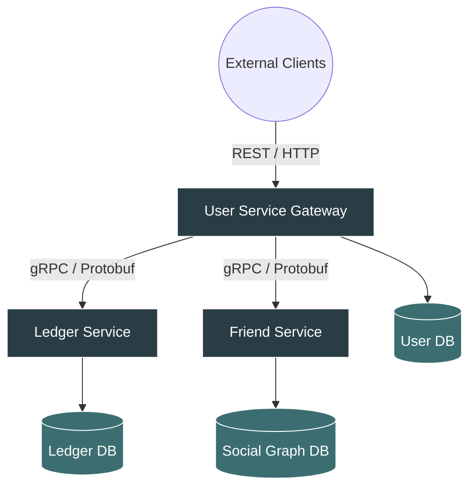

<div align="center">
  
# Nexus FinTech System
*A High-Performance, Distributed Financial Ledger & Social Graph Platform*

[](https://java.com)
[](https://spring.io/)
[](https://grpc.io/)
[](https://postgresql.org)
[](https://docker.com)

</div>

---

##  Executive Summary

Nexus is a deeply engineered, distributed microservices platform designed to handle complex financial transactions and social graphing with strict guarantees around data integrity, concurrency, and performance. 

Rather than relying on a monolithic architecture, the system is strictly bounded into independent domains (**User, Ledger, and Friend**). It leverages **gRPC** for ultra-low latency synchronous communication across bounded contexts. 

This project demonstrates a deep understanding of distributed systems, concurrency control, database optimization, and modern enterprise Java.

---

##  System Architecture



---

##  Engineering Decisions & Technical Depth

### 1. Data Integrity & Concurrency Control (The Ledger)
In a financial system, race conditions are catastrophic. To ensure absolute data consistency under highly concurrent traffic, the Ledger Service implements **Optimistic Locking** at the database layer. 
- By utilizing Hibernate's `@Version` mechanism on entity states, the system mathematically prevents the "lost update" problem and dual-spend anomalies without resorting to severe performance-bottlenecking pessimistic table locks.
- Transactions are strictly bounded via `@Transactional` to ensure ACID compliance across multi-table operations.

### 2. High-Performance Inter-Service Communication
REST/JSON over HTTP is human-readable but computationally expensive. To satisfy strict latency SLAs between microservices, **gRPC** and **Protocol Buffers (Protobuf)** were implemented.
- **Why?** Binary serialization dramatically reduces payload size and parsing overhead, allowing the User Service (acting as the ingress API gateway) to aggregate data from the Ledger and Friend services in fractions of a millisecond.
- Client stubs are generated dynamically during the Maven build phase, ensuring strict type-safety across distributed network boundaries.

### 3. Database Optimization & Memory Protection
A common pitfall in ORM implementations is the infamous N+1 query problem and unbounded memory loading.
- **Strict Pagination:** Endpoints querying high-volume transactional data (e.g., retrieving ledgers by date) utilize Spring Data `Pageable` interfaces. This enforces safe limits at the SQL execution level, actively preventing Out-Of-Memory (OOM) heap crashes on the JVM.
- **Query Optimization:** Removed redundant consecutive database hits (e.g., executing `existsById` followed immediately by `findById`). Replaced with optimal, single-trip `findById().orElseThrow()` patterns to minimize database connection pool exhaustion.

### 4. Architectural Immutability & Clean Code
- **Dependency Injection:** Replaced field injection (`@Autowired`) with strictly typed constructor injection (`@RequiredArgsConstructor`). This enforces immutability at the component level and ensures Spring beans cannot be instantiated in an invalid state, drastically improving unit testability.
- **Data Transfer Objects (DTOs):** Strict isolation between database entities and API responses. The internal schema is never leaked to the client, mapped safely via custom mapping layers.

---

##  Technology Stack

- **Backend:** Java 21+, Spring Boot 3.5.x, Spring Data JPA, Hibernate
- **Microservices:** gRPC, Protocol Buffers (Protobuf), REST API
- **Database:** PostgreSQL (Production), H2 (Local Development / Testing)
- **Infrastructure:** Docker, Docker Compose, Maven Build Lifecycle

---

##  Deployment & Local Execution

The entire distributed ecosystem can be spun up in isolation using Docker containerization, ensuring absolute parity between local development and production environments.

```bash
# Launch the full microservice cluster and databases
docker-compose up --build -d
```

*(Alternatively, services can be run bare-metal using the injected `com.h2database:h2:runtime` configurations for lightweight, localized JVM profiling).*
